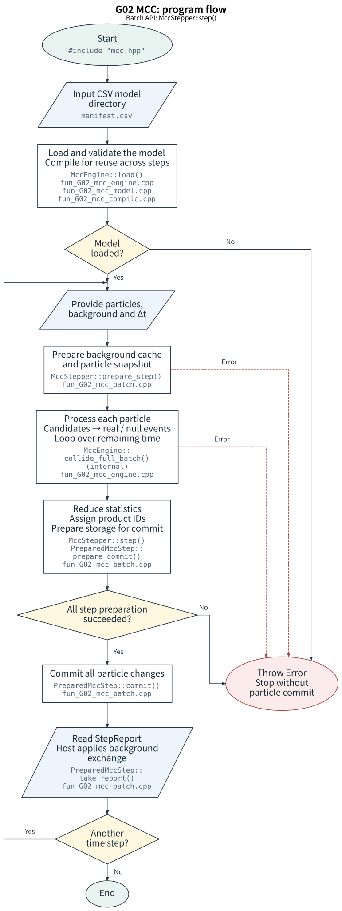
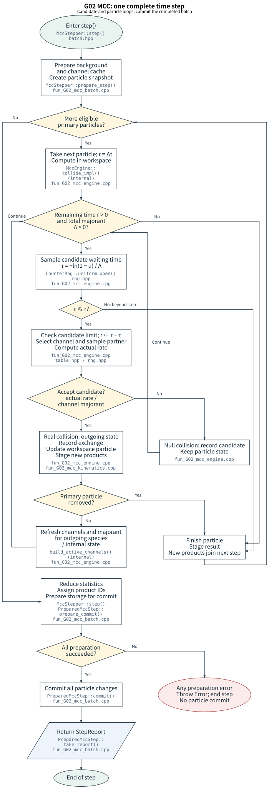

# G02_MCC_network: C++ collision network

[中文](README.zh-CN.md) | [English](README.en.md)

G02 is an independent C++20 MCC core. The host supplies particles, backgrounds and a time step. G02 samples reactions and returns particle updates, reaction counts and background momentum/energy exchange. G02 does not call `G01_MCC`; each module implements its own collisions.

Start with `MccStepper::step()`. Read the [collision-box tutorial](../../tests/009_collision/G02_MCC_network/examples/collision_box/README.en.md), then the [main guide](../../docs/source/rst_files/G_Collision/G02_MCC_network.rst) and [CSV format](../../docs/source/rst_files/G_Collision/G02_MCC_network/csv_format.rst).

## From data to one time step

1. Create a model directory. `MccEngine::load(model_dir)` reads `manifest.csv` and validates species, states, reactions and tables. Load the model once during initialization.
2. `MccStepper` snapshots particles/backgrounds and prepares active channels. For each particle it samples candidate waiting times, chooses a channel by its frequency bound and accepts or rejects it. A real event computes products; a null event only consumes waiting time. Continue through the remaining time.
3. After all preparation succeeds, allocate child IDs, prepare storage and commit together. Return `StepReport`; the host applies background exchange to subsequent steps.





## C++ integration

Include `mcc.hpp`; APIs are in `algoplasma::mcc`. `VectorParticleAdapter` adapts `vector<ParticleState>`, while `SoaParticleAdapter` adapts per-species field arrays. The host owns the particle storage.

```cpp
#include "mcc.hpp"
using namespace algoplasma::mcc;

// model_dir is a user-created directory following the CSV format guide.
MccEngine engine = MccEngine::load(model_dir);
MccStepper stepper(engine);
VectorParticleAdapter adapter(particles); // host-owned particles
MccWorkspace workspace;                  // retain across time steps
for (std::uint64_t step = 0; step < steps; ++step) {
    StepReport report = stepper.step(adapter, background, dt_s, step, seed, workspace);
    // Apply report.reservoir to background conditions for subsequent steps.
}
```

The host provides particles and backgrounds in this fragment. A complete buildable caller is in [documented callers](../../tests/009_collision/G02_MCC_network/examples/doc_snippets/README.md).

| Entry | Advancement and result |
|---|---|
| `MccStepper::step()` | Recommended batch entry. Completes the remaining time for each primary and commits updates, removals, species changes and children together. Children participate from the next step. Exceeding `StepOptions::max_candidates_per_particle` (default 1000000) throws; preparation failure does not commit. |
| `MccEngine::collide_full()` | Completes one primary's remaining time, continuing after species changes and ending on removal. Default candidate limit is 1000000; exceeding it throws `Error`. Returns `StepOutcome`; the host owns write-back and child storage. |
| `MccEngine::collide()` | Bounded single-particle advancement. `request.max_events_per_step=0` selects the model default of 64 candidates, including null events. Reaching the limit sets `event_limit_reached` and returns. `MoveSpecies` or `Remove` also ends processing, so return does not establish completion of dt. |

All three entries belong to G02. Bounded versus complete describes advancement behavior, not migration between G01 and G02. `collide()` can process multiple events.

## Objects and units

- `ParticleState`: valid species/state, stable unique ID, mesh cell, velocity in m/s, weight and birth step. Retain the adapter/ID high-water mark across steps to avoid reusing removed IDs.
- `CellBackground`: mesh cell plus `BackgroundComponent`; density in m^-3, temperature in K and mean velocity in m/s. `cell=UINT32_MAX` selects uniform fallback; local cells must match particles.
- Start with explicit background state IDs. `invalid_state=65535` selects a species-aggregate background; it is not ground state and does not distribute density among states.
- `StepReport`: candidates, real/null events, reaction counts, background number/momentum/energy exchange, conservation ledger and timings. Failures throw `algoplasma::mcc::Error`.

## Model input

The repository ships no cross-section data files or blank tables. Create a model directory following the [CSV guide](../../docs/source/rst_files/G_Collision/G02_MCC_network/csv_format.rst), which documents headers, references, units, defaults and a complete inline minimal example.

Two-body cross sections use relative energy in eV and values in m2. Two-/three-body temperature rate coefficients use m3/s and m6/s. The reader checks units without conversion. Successful loading does not establish the validity of the physical data or approximations.

## Build and test

From the repository root in Linux/WSL, with CMake 3.20 and a C++20 compiler:

```bash
cmake -S tests/009_collision/G02_MCC_network -B /tmp/g02_build -DCMAKE_BUILD_TYPE=Debug
cmake --build /tmp/g02_build -j 4
ctest --test-dir /tmp/g02_build --output-on-failure
```

CTest generates minimal synthetic fixtures at runtime under `/tmp/g02_build/generated_models/{demo_binary,demo_three_body,collision_box_elastic}` and schedules their setup automatically. Validate your own package with:

```bash
/tmp/g02_build/g02_validate_model /path/to/my_model
```

Add `-DG02_MCC_BUILD_TESTS=OFF` for a library-only build. Install with:

```bash
cmake --install /tmp/g02_build --prefix /tmp/g02_install
```

External CMake callers use `find_package(G02_MCC_network CONFIG REQUIRED)` and link `AlgoPlasma::G02_MCC`. Installation provides the C++ library and headers, without model data.

## CPU parallelism and workspace

`MccWorkspace` reuses scratch memory and channel caches and must not serve concurrent calls. The overload without workspace allocates a temporary one. Call one overload once per physical step.

For OpenMP, build with `-DG02_MCC_ENABLE_OPENMP=ON` and select `StepOptions.backend=CpuBackend::OpenMp`. For MPI, enable `-DG02_MCC_ENABLE_MPI=ON`, include `mpi.hpp`, link `AlgoPlasma::G02_MCC_MPI` and call `DistributedMccStepper::step()` on every participating rank. The host initializes MPI with at least `MPI_THREAD_FUNNELED` and destroys the stepper before `MPI_Finalize()`.

Prefix channel sampling is the default; alias sampling is available for many-channel workloads. Compare complete MCC-step timings for the same model and workload while checking statistics and conservation. See [performance notes](../../tests/009_collision/G02_MCC_network/PERFORMANCE.md).

## Supported models

G02 C01 is the common event-sampling flow. C02–C08 implement elastic collisions, discrete-state transitions, dissociation, ionization, attachment/detachment, charge exchange and recombination/neutralization. CSV `algorithm` uses reaction values such as C02, not C01.

Each reaction has one kinetic projectile and one or two background reactants. Two-body cross sections and two-/three-body temperature rate coefficients are supported. Background velocities follow drifting Maxwell distributions. Kinematics is classical and nonrelativistic; angular models are isotropic, cone or strictly constrained identity_exchange. Energy models are n_body_phase_space or equal_share with exactly two products.

G02 does not advance positions, solve fields, handle walls, partition MPI domains or migrate particles. Adding supported reactions changes data; new scattering laws or physical mechanisms require code and dedicated validation.

## Method references

See [Skullerud (1968)](https://doi.org/10.1088/0022-3727/1/11/423) for null collisions and [Vahedi–Surendra (1995)](https://doi.org/10.1016/0010-4655(94)00171-W) for PIC-MCC context. [Methods and verification references](../../docs/source/rst_files/G_Collision/G02_MCC_network/references.rst) map the clock, thermal partners and binary outcomes to sources, state the implementation's assumptions, and derive the collision-box reference curves.
