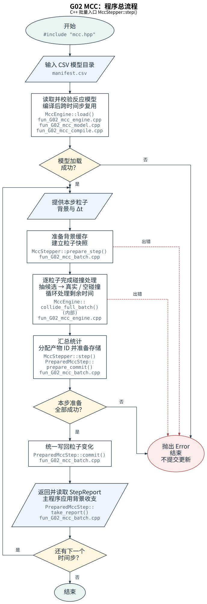
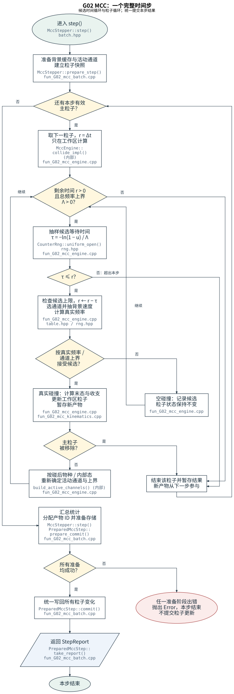

# G02_MCC_network：C++ 碰撞网络

[中文](README.zh-CN.md) | [English](README.en.md)

G02 是独立的 C++20 MCC 核心。主程序提供粒子、背景和时间步，G02 按反应网络抽样碰撞，返回粒子更新、反应计数以及背景的动量和能量收支。G02 不调用 `G01_MCC`；两个模块分别实现自己的碰撞算法。

初次接入推荐 `MccStepper::step()`。先读[零维碰撞盒](../../tests/009_collision/G02_MCC_network/examples/collision_box/README.zh-CN.md)，再看[文档主线](../../docs/source/rst_files/G_Collision/G02_MCC_network.rst)和[CSV 数据格式](../../docs/source/rst_files/G_Collision/G02_MCC_network/csv_format.rst)。

## 从数据到一个时间步

1. 用户准备模型目录，`MccEngine::load(model_dir)` 读取 `manifest.csv`，检查物种、内部态、反应和数据表；模型通常只加载一次。
2. `MccStepper` 读取粒子快照和背景，准备活动通道。为每个粒子抽样候选等待时间，按通道频率上界选择反应，再接受或拒绝。真实事件计算末态；空碰撞只消耗时间。剩余时间继续推进。
3. 全部粒子准备成功后，统一分配新 ID、准备存储并提交。返回 `StepReport`；主程序用背景收支更新后续背景。





## C++ 接入

公共入口头文件是 `mcc.hpp`，命名空间是 `algoplasma::mcc`。`VectorParticleAdapter` 接入 `vector<ParticleState>`；`SoaParticleAdapter` 接入按物种存放的字段数组。粒子容器归主程序所有。

```cpp
#include "mcc.hpp"
using namespace algoplasma::mcc;

// model_dir 为用户按 CSV 格式说明准备的目录。
MccEngine engine = MccEngine::load(model_dir);
MccStepper stepper(engine);
VectorParticleAdapter adapter(particles); // particles 由主程序创建
MccWorkspace workspace;                  // 在时间循环外创建
for (std::uint64_t step = 0; step < steps; ++step) {
    StepReport report = stepper.step(adapter, background, dt_s, step, seed, workspace);
    // 主程序按 report.reservoir 更新下一步的背景条件。
}
```

上述片段的粒子和背景由宿主提供。可直接构建的完整程序见[文档调用示例](../../tests/009_collision/G02_MCC_network/examples/doc_snippets/README.md)。

| 入口 | 时间推进与结果 |
|---|---|
| `MccStepper::step()` | 推荐的整批入口。完整处理每个主粒子的本步剩余时间，统一提交更新、删除、物种迁移和新产物；新产物从下一步参与。候选数超过 `StepOptions::max_candidates_per_particle`（默认 1000000）时报错，准备失败不提交。 |
| `MccEngine::collide_full()` | 单粒子完整推进；物种改变后继续剩余时间，移除后结束。候选上限默认 1000000，超过上限抛 `Error`；返回 `StepOutcome`，宿主负责写回和产物存储。 |
| `MccEngine::collide()` | 单粒子受限推进；`request.max_events_per_step=0` 选模型默认上限 64，统计的是候选，包括空碰撞。达到上限设置 `event_limit_reached` 并返回；`MoveSpecies` 或 `Remove` 时提前结束，因此返回不代表完整处理了 dt。 |

这些入口都属于 G02。这里的“受限”和“完整”指推进行为，不指 G01/G02 版本迁移。`collide()` 也不是每次只能碰撞一次。

## 数据对象与单位

- `ParticleState`：有效 `species/state`、稳定唯一的 `id`、网格编号 `cell`、速度 m/s、权重和出生步。适配器与 ID 高水位跨步保留，避免重新使用删除粒子的 ID。
- `CellBackground`：网格编号和 `BackgroundComponent`；背景密度 m^-3、温度 K、平均速度 m/s。`cell=UINT32_MAX` 是全域备用背景；实际局部编号须与粒子一致。
- 入门时给背景填写实际内部态。`invalid_state=65535` 只表示按物种合并的背景，不是基态，也不自动分配各态密度。
- `StepReport`：候选、真实/空事件、反应计数、背景粒子数/动量/能量收支、守恒账本和分段耗时。失败抛 `algoplasma::mcc::Error`。

## 截面与模型文件

仓库不提供截面数据文件或空白表格。用户按[CSV 格式说明](../../docs/source/rst_files/G_Collision/G02_MCC_network/csv_format.rst)创建模型目录；文档列出所有表头、关联关系、单位、默认值和完整的内联最小示例。

二体截面以相对能量 eV 为横轴、m2 为纵轴；二体/三体温度速率系数分别用 m3/s 和 m6/s。读取器检查单位但不做换算。表格检查通过不等于反应数据或物理近似适用于研究对象。

## 构建与测试

在 Linux/WSL 的仓库根目录运行，需要 CMake 3.20 和 C++20 编译器：

```bash
cmake -S tests/009_collision/G02_MCC_network -B /tmp/g02_build -DCMAKE_BUILD_TYPE=Debug
cmake --build /tmp/g02_build -j 4
ctest --test-dir /tmp/g02_build --output-on-failure
```

测试在运行时生成最小合成数据到 `/tmp/g02_build/generated_models/{demo_binary,demo_three_body,collision_box_elastic}`；CTest 自动安排生成步骤。独立检查用户模型：

```bash
/tmp/g02_build/g02_validate_model /path/to/my_model
```

只构建库时加 `-DG02_MCC_BUILD_TESTS=OFF`。安装和外部链接：

```bash
cmake --install /tmp/g02_build --prefix /tmp/g02_install
```

外部 CMake 使用 `find_package(G02_MCC_network CONFIG REQUIRED)`，链接 `AlgoPlasma::G02_MCC`；安装包只提供 C++ 库和头文件，不提供模型数据。

## CPU 并行与工作区

`MccWorkspace` 复用临时内存和通道缓存，同一对象不能并发重入。省略工作区的 `step()` 重载使用一次性工作区；同一物理时间步只调用一次。

OpenMP：构建时加 `-DG02_MCC_ENABLE_OPENMP=ON`，通过 `StepOptions.backend=CpuBackend::OpenMp` 选择线程后端。MPI：加 `-DG02_MCC_ENABLE_MPI=ON`，包含 `mpi.hpp`，链接 `AlgoPlasma::G02_MCC_MPI`，所有相关进程共同调用 `DistributedMccStepper::step()`。主程序先初始化 MPI，提供至少 `MPI_THREAD_FUNNELED` 的支持，并在 `MPI_Finalize()` 前销毁步进器。

默认使用前缀通道抽样；多通道可选择别名采样。用同一模型和粒子负载测量完整 MCC 步耗时，同时检查统计和守恒，详见[性能说明](../../tests/009_collision/G02_MCC_network/PERFORMANCE.md)。

## 支持范围

G02 的 C01 是公共事件抽样流程，C02–C08 分别处理弹性、离散态跃迁、解离、电离、附着/脱附、电荷交换和复合/中和。CSV 的 `algorithm` 填 C02 等反应值，不填 C01。

每条反应有一个 kinetic projectile 和一到两个 background 反应物；支持二体截面和二体/三体温度速率系数。背景速度按带漂移的 Maxwell 分布抽样。当前运动学为经典非相对论模型，角度模型为 isotropic、cone 或满足严格条件的 identity_exchange，能量模型为 n_body_phase_space 或恰好两个产物的 equal_share。

G02 不推进位置、不求场、不处理壁面，也不划分 MPI 网格或迁移粒子。新增已有类型的反应可以改数据；新增散射律或其他物理机制需要扩展代码和对应验证。

## 方法依据与文献

空碰撞方法参见 [Skullerud (1968)](https://doi.org/10.1088/0022-3727/1/11/423)，PIC-MCC 背景参见 [Vahedi–Surendra (1995)](https://doi.org/10.1016/0010-4655(94)00171-W)。指数时钟、热背景速度和两体末态的出处及实现对应见[方法与验证文献](../../docs/source/rst_files/G_Collision/G02_MCC_network/references.rst)。其中也列出本库流程的适用条件及碰撞盒理论曲线的推导。
