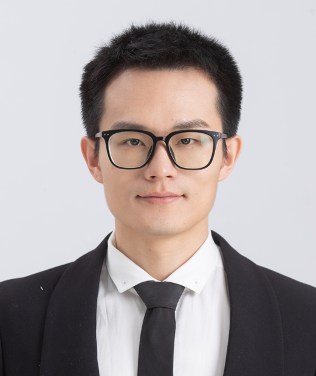
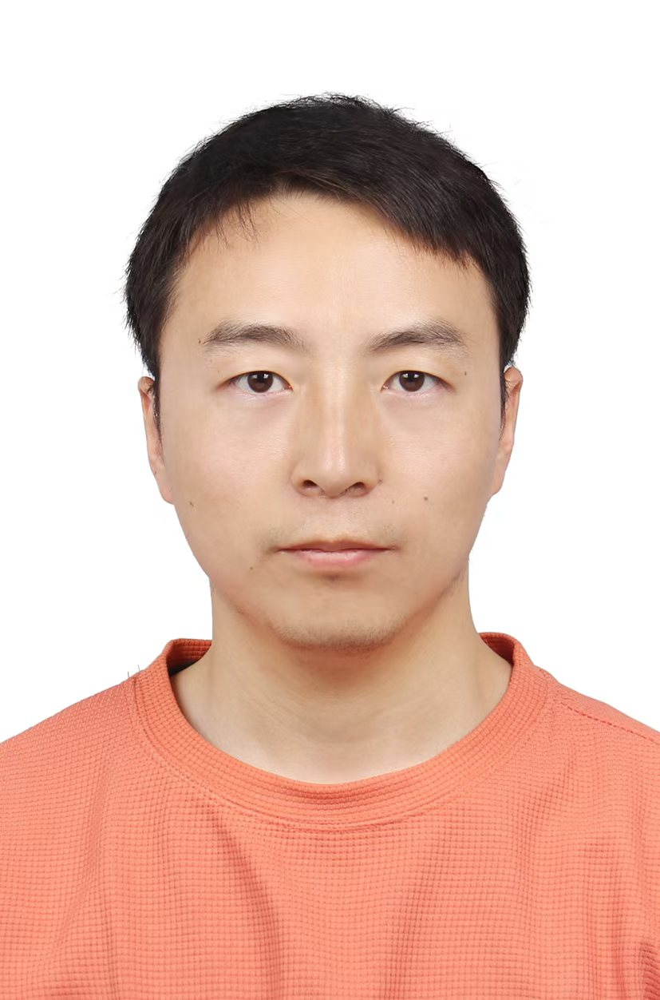
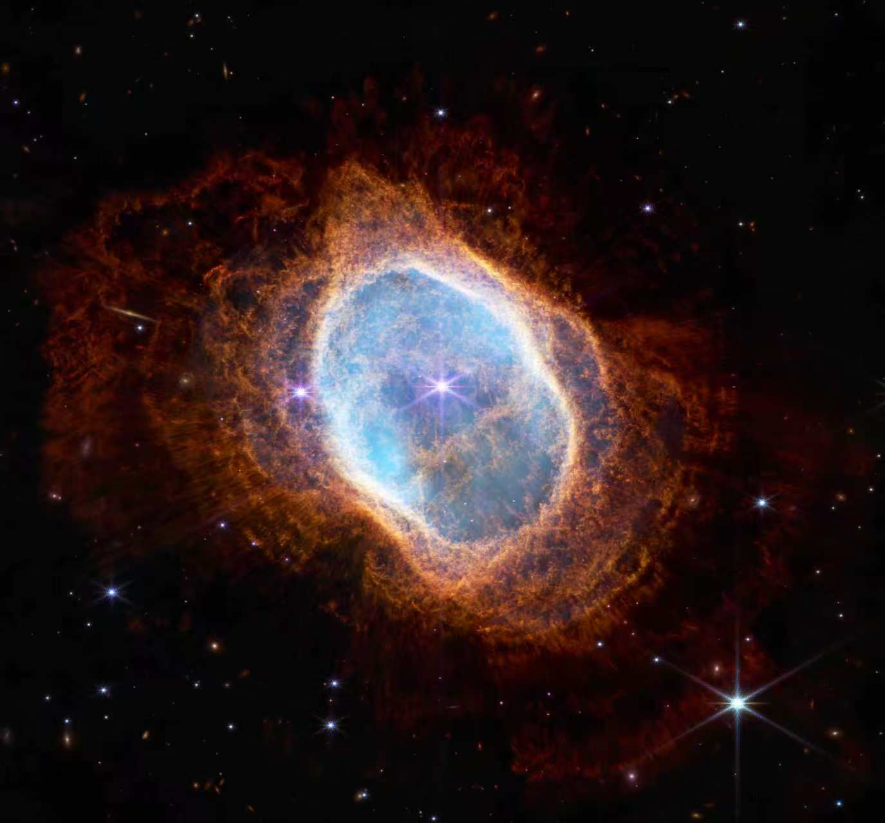

# Contributors / 贡献者

<!-- This page is generated from `contributors.yml` at the repository root.
     Edit that file and run `python3 tools/generate_contributors.py` instead of
     editing the block below by hand. -->

  <button type="button" class="ap-lang-button" data-ap-set-lang="zh">中文</button>
  <button type="button" class="ap-lang-button" data-ap-set-lang="en">English</button>

<!-- CONTRIBUTORS:START -->

<h2 class="ap-contributor-heading">项目负责人</h2>
<table class="ap-work-list ap-work-list--lead">
  <thead>
    <tr>
      <th scope="col" align="left" width="160">成员</th>
      <th scope="col" align="left">个人简介</th>
    </tr>
  </thead>
  <tbody>
    <tr>
      <td class="ap-member" align="center" width="160" valign="top">
        

          
          

            <strong><a href="https://github.com/Yin-YinjianZhao">赵隐剑</a></strong> 
            项目负责人
             <small class="ap-member-links"><a href="https://homepage.hit.edu.cn/zhaoyinjian">个人主页</a> <a href="https://github.com/Yin-YinjianZhao">GitHub</a> <a href="https://gitee.com/Yin-YinjianZhao">Gitee</a></small>
          

        

      </td>
      <td class="ap-work-cell" valign="top">
        
哈尔滨工业大学副教授，曾在劳伦斯伯克利国家实验室从事博士后研究，获美国南加州大学航天工程博士学位。长期从事等离子体物理与数值模拟研究，研究方向涵盖空间电推进、核聚变、半导体、加速器、数值模拟算法及高性能并行计算等。

        
我希望在科研与教学的道路上，将 AlgoPlasma 作为一生耕耘的事业，服务于等离子体领域的科研、教育与产业，为这一领域的发展尽一份绵薄之力。

        
与大家共勉：

        <blockquote class="ap-member-quote">
自持微光，不与群星争辉。 照亮己路，亦可温暖旁人。
</blockquote>
      </td>
    </tr>
  </tbody>
</table>
<h2 class="ap-contributor-heading">现任维护者</h2>
<table class="ap-maintainers">
  <tr>
    <td width="33.333%" valign="top">
      

        
        

          <strong><a href="https://gitee.com/HermiteCat">王佰胜</a></strong> 
          博士在读
           <small class="ap-member-links"><a href="https://gitee.com/HermiteCat">Gitee</a></small>
        

      

      

        
<strong>研究方向</strong> 空间电推进空心阴极实验及模拟

      

    </td>
    <td width="33.333%" valign="top">
      

        
        

          <strong><a href="https://gitee.com/lzhe898">刘哲</a></strong> 
          博士在读
           <small class="ap-member-links"><a href="https://gitee.com/lzhe898">Gitee</a></small>
        

      

      

        
<strong>研究方向</strong> 光致电离、稠密等离子体焦点

      

    </td>
    <td width="33.333%" valign="top">
      

        
        

          <strong><a href="https://github.com/GooseGH">赵中平</a></strong> 
          博士在读
           <small class="ap-member-links"><a href="https://github.com/GooseGH">GitHub</a> <a href="https://gitee.com/GooseGH">Gitee</a></small>
        

      

      

        
<strong>研究方向</strong> 霍尔推力器不稳定性实验及模拟

      

    </td>
  </tr>
  <tr>
    <td width="33.333%" valign="top">
      

        
        

          <strong><a href="https://gitee.com/peng-zilong123">彭子龙</a></strong> 
          硕士在读
           <small class="ap-member-links"><a href="https://gitee.com/peng-zilong123">Gitee</a></small>
        

      

      

        
<strong>研究方向</strong> 等离子体波动实验诊断

      

    </td>
    <td width="33.333%" valign="top">
      

        
        

          <strong><a href="https://gitee.com/Luo-Xin-410">罗鑫</a></strong> 
          博后在站
           <small class="ap-member-links"><a href="https://gitee.com/Luo-Xin-410">Gitee</a></small>
        

      

      

        
<strong>研究方向</strong> 霍尔推力器电子反常传导

      

    </td>
    <td width="33.333%" valign="top">
      

        
        

          <strong><a href="https://orcid.org/0009-0009-6248-9781">谢礼桓</a></strong> 
          博士在读
           <small class="ap-member-links"><a href="https://orcid.org/0009-0009-6248-9781">ORCID</a></small>
        

      

      

        
<strong>研究方向</strong> 碘工质霍尔推力器不稳定性

      

    </td>
  </tr>
  <tr>
    <td width="33.333%" valign="top">
      

        
        

          <strong>陈曦</strong> 
          博士在读
        

      

      

        
<strong>研究方向</strong> 三维PIC加速方法及降维模型

      

    </td>
    <td width="33.333%" valign="top">
      

        
        

          <strong><a href="https://gitee.com/jiaohuadetudouni">陈英杰</a></strong> 
          博士在读
           <small class="ap-member-links"><a href="https://gitee.com/jiaohuadetudouni">Gitee</a></small>
        

      

      

        
<strong>研究方向</strong> 柱坐标PIC算法优化

      

    </td>
    <td width="33.333%" valign="top">
      

        
        

          <strong>钟昆硼</strong> 
          硕士在读
        

      

      

        
<strong>研究方向</strong> 霍尔推力器磁聚焦机理

      

    </td>
  </tr>
  <tr>
    <td width="33.333%" valign="top">
      

        
        

          <strong><a href="https://gitee.com/HIT-ZhouZhijun">周志君</a></strong> 
          博士在读
           <small class="ap-member-links"><a href="https://gitee.com/HIT-ZhouZhijun">Gitee</a></small>
        

      

      

        
<strong>研究方向</strong> 霍尔推力器周向非均匀及不稳定性

      

    </td>
    <td width="33.333%" valign="top">
      

        
        

          <strong>张武顺</strong> 
          博士在读
        

      

      

        
<strong>研究方向</strong> 高超声速飞行器电子发汗冷却

      

    </td>
    <td width="33.333%" valign="top">
      

        
        

          <strong>胡长征</strong> 
          硕士在读
        

      

      

        
<strong>研究方向</strong> 等离子体波动理论

      

    </td>
  </tr>
</table>

<h2 class="ap-contributor-heading">Project Lead</h2>
<table class="ap-work-list ap-work-list--lead">
  <thead>
    <tr>
      <th scope="col" align="left" width="160">Member</th>
      <th scope="col" align="left">Biography</th>
    </tr>
  </thead>
  <tbody>
    <tr>
      <td class="ap-member" align="center" width="160" valign="top">
        

          
          

            <strong><a href="https://github.com/Yin-YinjianZhao">Yinjian Zhao</a></strong> 
            Project Lead
             <small class="ap-member-links"><a href="https://homepage.hit.edu.cn/zhaoyinjian">Homepage</a> <a href="https://github.com/Yin-YinjianZhao">GitHub</a> <a href="https://gitee.com/Yin-YinjianZhao">Gitee</a></small>
          

        

      </td>
      <td class="ap-work-cell" valign="top">
        
I am an Associate Professor at Harbin Institute of Technology. I conducted postdoctoral research at Lawrence Berkeley National Laboratory and earned my PhD in Astronautical Engineering from the University of Southern California. My research has long focused on plasma physics and numerical simulation, spanning space electric propulsion, nuclear fusion, semiconductors, accelerators, numerical simulation algorithms, and high-performance parallel computing.

        
Throughout my career in research and teaching, I hope to make AlgoPlasma a lifelong endeavor, serving the plasma community across research, education, and industry, and contributing in my own small way to the field's progress.

        
A thought to share:

        <blockquote class="ap-member-quote">
Try to become not a man of success, but try rather to become a man of value. — Albert Einstein
</blockquote>
      </td>
    </tr>
  </tbody>
</table>
<h2 class="ap-contributor-heading">Current Maintainers</h2>
<table class="ap-maintainers">
  <tr>
    <td width="33.333%" valign="top">
      

        
        

          <strong><a href="https://gitee.com/HermiteCat">Baisheng Wang</a></strong> 
          PhD Student
           <small class="ap-member-links"><a href="https://gitee.com/HermiteCat">Gitee</a></small>
        

      

      

        
<strong>Research Interests</strong> Experiments and simulations of hollow cathodes for space electric propulsion

      

    </td>
    <td width="33.333%" valign="top">
      

        
        

          <strong><a href="https://gitee.com/lzhe898">Zhe Liu</a></strong> 
          PhD Student
           <small class="ap-member-links"><a href="https://gitee.com/lzhe898">Gitee</a></small>
        

      

      

        
<strong>Research Interests</strong> Photoionization and dense plasma focus

      

    </td>
    <td width="33.333%" valign="top">
      

        
        

          <strong><a href="https://github.com/GooseGH">Zhongping Zhao</a></strong> 
          PhD Student
           <small class="ap-member-links"><a href="https://github.com/GooseGH">GitHub</a> <a href="https://gitee.com/GooseGH">Gitee</a></small>
        

      

      

        
<strong>Research Interests</strong> Experiments and simulations of instabilities in Hall thrusters

      

    </td>
  </tr>
  <tr>
    <td width="33.333%" valign="top">
      

        
        

          <strong><a href="https://gitee.com/peng-zilong123">Zilong Peng</a></strong> 
          Master&#x27;s Student
           <small class="ap-member-links"><a href="https://gitee.com/peng-zilong123">Gitee</a></small>
        

      

      

        
<strong>Research Interests</strong> Experimental diagnostics of plasma waves

      

    </td>
    <td width="33.333%" valign="top">
      

        
        

          <strong><a href="https://gitee.com/Luo-Xin-410">Xin Luo</a></strong> 
          Postdoctoral Researcher
           <small class="ap-member-links"><a href="https://gitee.com/Luo-Xin-410">Gitee</a></small>
        

      

      

        
<strong>Research Interests</strong> Anomalous electron transport in Hall thrusters

      

    </td>
    <td width="33.333%" valign="top">
      

        
        

          <strong><a href="https://orcid.org/0009-0009-6248-9781">Lihuan Xie</a></strong> 
          PhD Student
           <small class="ap-member-links"><a href="https://orcid.org/0009-0009-6248-9781">ORCID</a></small>
        

      

      

        
<strong>Research Interests</strong> Instabilities in iodine-propellant Hall thrusters

      

    </td>
  </tr>
  <tr>
    <td width="33.333%" valign="top">
      

        
        

          <strong>Xi Chen</strong> 
          PhD Student
        

      

      

        
<strong>Research Interests</strong> Acceleration methods for 3D PIC simulations and reduced-dimensional models

      

    </td>
    <td width="33.333%" valign="top">
      

        
        

          <strong><a href="https://gitee.com/jiaohuadetudouni">Yingjie Chen</a></strong> 
          PhD Student
           <small class="ap-member-links"><a href="https://gitee.com/jiaohuadetudouni">Gitee</a></small>
        

      

      

        
<strong>Research Interests</strong> Optimization of PIC algorithms in cylindrical coordinates

      

    </td>
    <td width="33.333%" valign="top">
      

        
        

          <strong>Kunpeng Zhong</strong> 
          Master&#x27;s Student
        

      

      

        
<strong>Research Interests</strong> Magnetic focusing mechanisms in Hall thrusters

      

    </td>
  </tr>
  <tr>
    <td width="33.333%" valign="top">
      

        
        

          <strong><a href="https://gitee.com/HIT-ZhouZhijun">Zhijun Zhou</a></strong> 
          PhD Student
           <small class="ap-member-links"><a href="https://gitee.com/HIT-ZhouZhijun">Gitee</a></small>
        

      

      

        
<strong>Research Interests</strong> Azimuthal nonuniformity and instabilities in Hall thrusters

      

    </td>
    <td width="33.333%" valign="top">
      

        
        

          <strong>Wushun Zhang</strong> 
          PhD Student
        

      

      

        
<strong>Research Interests</strong> Electron transpiration cooling of hypersonic vehicles

      

    </td>
    <td width="33.333%" valign="top">
      

        
        

          <strong>Changzheng Hu</strong> 
          Master&#x27;s Student
        

      

      

        
<strong>Research Interests</strong> Theory of plasma waves

      

    </td>
  </tr>
</table>

<!-- CONTRIBUTORS:END -->
