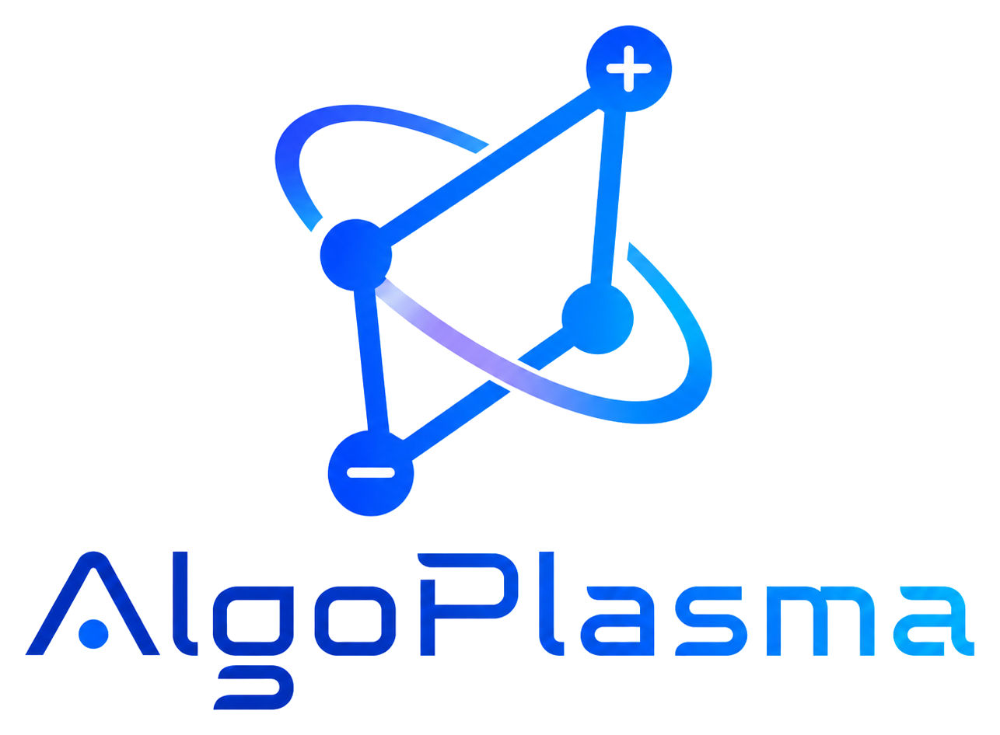

.. rst-class:: ap-home-document-title

==========
AlgoPlasma
==========

.. toctree::
    :caption: Subroutines (by ID)
    :maxdepth: 1
    :glob:
    :includehidden:
    :hidden:

    ./rst_files/*

.. toctree::
    :caption: Tests
    :maxdepth: 1
    :hidden:

    ./tests/index

.. toctree::
    :caption: Examples
    :maxdepth: 1
    :hidden:

    ./examples/index

.. toctree::
    :caption: Reference
    :maxdepth: 1
    :hidden:

    ./developer_onboarding
    ./glossary
    ./maintenance_checklist

.. raw:: html

   

     <button type="button" class="ap-lang-button" data-ap-set-lang="zh">中文</button>
     <button type="button" class="ap-lang-button" data-ap-set-lang="en">English</button>
   

   

     <section class="ap-home-hero">
       

       
       

         
Open Algorithms for Plasma Modeling

         <h1>AlgoPlasma</h1>
         

          AlgoPlasma 致力于把等离子体建模中分散、重复实现的核心算法，
          沉淀为开放、可复用、可测试、可解释的算法库。
         

         

           <a class="ap-home-action ap-home-action-primary" href="developer_onboarding.html">快速入门</a>
           <a class="ap-home-action" href="examples/index.html">查看示例</a>
           <a class="ap-home-action" href="tests/index.html">查看测试</a>
           <a class="ap-home-action" href="glossary.html">术语表</a>
           <a class="ap-home-action" href="https://github.com/AlgoPlasma/AlgoPlasma" target="_blank" rel="noopener noreferrer">GitHub 源码</a>
           <a class="ap-home-action" href="https://e.gitee.com/algoplasma/repos/algoplasma/algoplasma/sources" target="_blank" rel="noopener noreferrer">Gitee 源码</a>
         

       

       

        配图来自基于 AlgoPlasma 搭建的 AP-PIC-HET-3D 程序。 
         <a href="https://arxiv.org/abs/2603.14849v1" target="_blank" rel="noopener noreferrer">arXiv: 2603.14849v1</a>, 16 Mar 2026.
       

     </section>

     <section class="ap-home-section">
       

        <h2>算法模块</h2>
         <a href="genindex.html">API 索引</a>
       

       

         <a class="ap-module-card" style="--accent:#2c7be5" href="rst_files/A_Pusher.html"><strong>A_Pusher</strong>粒子推进</a>
         <a class="ap-module-card" style="--accent:#00a887" href="rst_files/B_Scatter.html"><strong>B_Scatter</strong>粒子到网格沉积</a>
         <a class="ap-module-card" style="--accent:#7b61ff" href="rst_files/C_Gather.html"><strong>C_Gather</strong>网格到粒子插值</a>
         <a class="ap-module-card" style="--accent:#d9822b" href="rst_files/D_Poisson.html"><strong>D_Poisson</strong>Poisson 求解</a>
         <a class="ap-module-card" style="--accent:#1f9bb4" href="rst_files/E_Maxwell.html"><strong>E_Maxwell</strong>Maxwell</a>
         <a class="ap-module-card" style="--accent:#5964d8" href="rst_files/F_IO.html"><strong>F_IO</strong>数据输入输出</a>
         <a class="ap-module-card" style="--accent:#c94c4c" href="rst_files/G_collision.html"><strong>G_collision</strong>碰撞模型</a>
         <a class="ap-module-card" style="--accent:#178f66" href="rst_files/H_MPI_Exchange.html"><strong>H_MPI_Exchange</strong>MPI 数据交换</a>
         <a class="ap-module-card" style="--accent:#b7791f" href="rst_files/I_Initializer.html"><strong>I_Initializer</strong>初始化</a>
         <a class="ap-module-card" style="--accent:#4a78a6" href="rst_files/J_Fluid.html"><strong>J_Fluid</strong>流体算法</a>
       

     </section>

     <section class="ap-home-section">
       

         <article class="ap-home-panel">
           <h2>测试文档</h2>
           
测试位于 <code>tests/</code>，包含编译、运行、清理脚本和验证说明。修改算法后建议先运行对应局部测试。

           <a class="ap-home-text-link" href="tests/index.html">进入 Tests 总览</a>
         </article>
         <article class="ap-home-panel">
           <h2>术语与维护</h2>
           
术语表统一网格、粒子和并行词汇；维护清单用于检查语言切换、API 包裹和 Sphinx warning。

           <a class="ap-home-text-link" href="maintenance_checklist.html">打开维护清单</a>
         </article>
         <article class="ap-home-panel">
           <h2>文档构建</h2>
           
文档基于 Sphinx、Doxygen 和 Breathe 构建，源文件位于 <code>docs/source/</code>。

           <pre><code>cd docs
   ./make.sh</code></pre>
           
默认自动选择并行编译线程。

         </article>
       

     </section>

     <section class="ap-home-footer-band">
      
欢迎贡献服务于等离子体科学的算法实现、案例测试、文档说明和结果验证。

      
本项目采用 <a href="LICENSE">Apache License 2.0</a> 开源许可证；版权和归属信息见 <a href="NOTICE">NOTICE</a>。

      
发起人：赵隐剑 · contact@algoplasma.com · <a href="https://homepage.hit.edu.cn/zhaoyinjian" target="_blank" rel="noopener noreferrer">Homepage</a>

     </section>
   

   

     <section class="ap-home-hero">
       

       
       

         
Open Algorithms for Plasma Modeling

         <h1>AlgoPlasma</h1>
         

          AlgoPlasma turns scattered and repeatedly reimplemented core algorithms for plasma modeling into
          an open, reusable, tested, and explainable algorithm library.
         

         

           <a class="ap-home-action ap-home-action-primary" href="developer_onboarding.html">Quick Start</a>
           <a class="ap-home-action" href="examples/index.html">View Examples</a>
           <a class="ap-home-action" href="tests/index.html">View Tests</a>
           <a class="ap-home-action" href="glossary.html">Glossary</a>
           <a class="ap-home-action" href="https://github.com/AlgoPlasma/AlgoPlasma" target="_blank" rel="noopener noreferrer">GitHub Source</a>
           <a class="ap-home-action" href="https://e.gitee.com/algoplasma/repos/algoplasma/algoplasma/sources" target="_blank" rel="noopener noreferrer">Gitee Source</a>
         

       

       

        Image rendered from an AP-PIC-HET-3D program built on AlgoPlasma. 
         <a href="https://arxiv.org/abs/2603.14849v1" target="_blank" rel="noopener noreferrer">arXiv: 2603.14849v1</a>, 16 Mar 2026.
       

     </section>

     <section class="ap-home-section">
       

        <h2>Algorithm Modules</h2>
         <a href="genindex.html">API Index</a>
       

       

         <a class="ap-module-card" style="--accent:#2c7be5" href="rst_files/A_Pusher.html"><strong>A_Pusher</strong>Particle pushers</a>
         <a class="ap-module-card" style="--accent:#00a887" href="rst_files/B_Scatter.html"><strong>B_Scatter</strong>Particle-to-grid deposition</a>
         <a class="ap-module-card" style="--accent:#7b61ff" href="rst_files/C_Gather.html"><strong>C_Gather</strong>Grid-to-particle interpolation</a>
         <a class="ap-module-card" style="--accent:#d9822b" href="rst_files/D_Poisson.html"><strong>D_Poisson</strong>Poisson solvers</a>
         <a class="ap-module-card" style="--accent:#1f9bb4" href="rst_files/E_Maxwell.html"><strong>E_Maxwell</strong>Maxwell</a>
         <a class="ap-module-card" style="--accent:#5964d8" href="rst_files/F_IO.html"><strong>F_IO</strong>Data input and output</a>
         <a class="ap-module-card" style="--accent:#c94c4c" href="rst_files/G_collision.html"><strong>G_collision</strong>Collision models</a>
         <a class="ap-module-card" style="--accent:#178f66" href="rst_files/H_MPI_Exchange.html"><strong>H_MPI_Exchange</strong>MPI data exchange</a>
         <a class="ap-module-card" style="--accent:#b7791f" href="rst_files/I_Initializer.html"><strong>I_Initializer</strong>Initialization</a>
         <a class="ap-module-card" style="--accent:#4a78a6" href="rst_files/J_Fluid.html"><strong>J_Fluid</strong>Fluid algorithms</a>
       

     </section>

     <section class="ap-home-section">
       

         <article class="ap-home-panel">
           <h2>Tests</h2>
           
Tests live under <code>tests/</code> and include build, run, clean scripts, and validation notes. After changing an algorithm, start with its local tests.

           <a class="ap-home-text-link" href="tests/index.html">Open Tests Overview</a>
         </article>
         <article class="ap-home-panel">
           <h2>Terms and Maintenance</h2>
           
The glossary standardizes grid, particle, and parallel terms; the checklist covers language switches, API wrapping, and Sphinx warnings.

           <a class="ap-home-text-link" href="maintenance_checklist.html">Open Checklist</a>
         </article>
         <article class="ap-home-panel">
           <h2>Documentation</h2>
           
The docs are built with Sphinx, Doxygen, and Breathe. Source files live under <code>docs/source/</code>.

           <pre><code>cd docs
   ./make.sh</code></pre>
           
Uses automatic parallel build jobs by default.

         </article>
       

     </section>

     <section class="ap-home-footer-band">
      
Contributions are welcome for algorithm implementations, test cases, documentation, and result validation that serve plasma science.

      
AlgoPlasma is licensed under the <a href="LICENSE">Apache License 2.0</a>; copyright and attribution information is available in <a href="NOTICE">NOTICE</a>.

      
Initiator: Yinjian ZHAO · contact@algoplasma.com · <a href="https://homepage.hit.edu.cn/zhaoyinjian" target="_blank" rel="noopener noreferrer">Homepage</a>

     </section>
   

