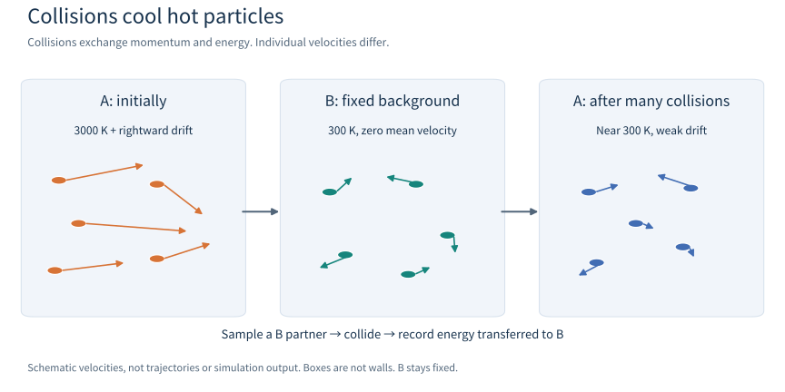
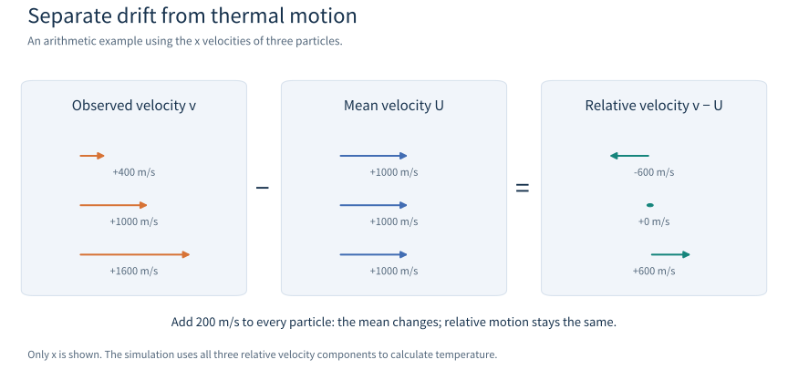
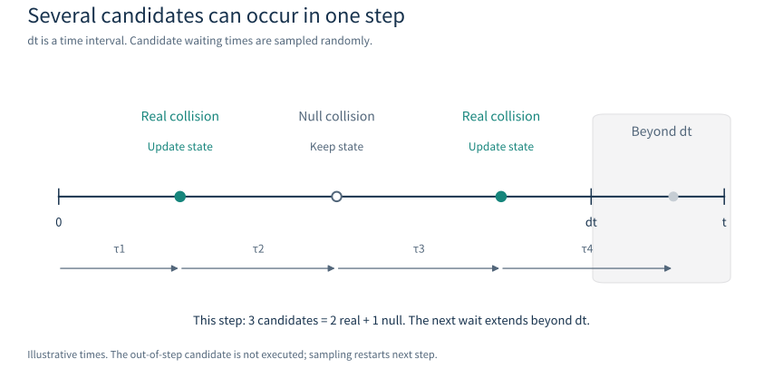

# Collision box: watch hot particles cool down

[中文](README.zh-CN.md) | [English](README.en.md)

This example asks one question: **what happens when hot A particles, initially moving together to the right, repeatedly collide with a colder B gas?**

Expect the average motion of A to weaken and its temperature to approach the background's 300 K.
The program compares its simulation with the theory for this simple model.
Knowing speed, kinetic energy and averages is enough to run it and read the plots.
The equations can wait until a second reading.

> **Data use:** A and B are fictional names. Their masses and collision rate are synthetic values chosen to test the software.
> Passing this example checks the specified model; these data cannot support conclusions about a real gas.

## 1. Picture the experiment



*Arrows show velocities and boxes group the ideas. This is a schematic, not simulation output.*

Imagine A and B as small balls exchanging momentum and energy when they collide.
This picture is a guide: the program samples collision probabilities rather than following ball surfaces until they touch.

| Part | How it is represented | Default |
|---|---|---|
| A: particles we observe | Three velocity components stored for each particle | 50,000 particles; initially 3000 K with a mean x velocity of 1000 m/s |
| B: surrounding gas | Density, temperature and mean velocity; a B velocity is sampled for each collision | Density `1e20 m^-3`; 300 K; zero mean velocity |
| One collision | `A + B -> A + B`, changing velocities | Equal masses of `4e-26 kg`; elastic scattering |
| Simulated time | Repeatedly process collisions within each time step | 200 steps of `1e-7 s`, or 20 microseconds in total |

`1e20` means 10 to the power 20; `1e-7 s` is 0.1 microseconds.
K means kelvin; 300 K is about 27 °C.
The density counts B particles per cubic metre. It is a separate setting from the number of A particles stored in the program.

### What does “zero-dimensional” mean?

The gas is treated as one uniform region whose properties evolve in time.
Every A sees the same background, so there is no distinction between the left and right of a box.
Positions are not advanced and there are no walls.
**Each velocity still has x, y and z components.** Zero-dimensional describes the spatial simplification.

The example uses only G02 collisions. It does not solve electric fields or follow trajectories and needs no other AlgoPlasma module.

### Follow one A particle

Call it A001. The program stores its velocity and samples a wait to the next candidate.
If the wait exceeds the time left, the step ends.
A real collision samples a B velocity, computes outgoing velocities, updates A001
and records momentum and energy transferred to B.

Each A gets a different history. Averaging many histories produces a smoother temperature curve.
One A can speed up in a particular collision while the population cools over time.

### Temperature and overall motion

Imagine a group walking to the right while each person also moves around within the group:

- The average velocity describes **drift**, the motion of the group as a whole.
- Motion relative to that average describes **thermal motion**. Its average kinetic energy determines the temperature here.

Drift and temperature can be varied separately. B has zero average velocity, while its individual particles still move at 300 K.
All temperatures here are translational temperatures, calculated from random motion in three directions.



In this arithmetic example, `(400 + 1000 + 1600) / 3 = 1000 m/s`.
Relative velocities are `−600, 0, +600 m/s`.
Adding 200 m/s to all three changes the mean to 1200 m/s and leaves relative velocities unchanged.
That common acceleration does not change temperature.
The picture shows x only; the simulation uses all three components.

### How can an elastic collision cool A?

An elastic collision preserves the **total momentum and kinetic energy of both partners**.
One A can transfer energy to B or receive energy from B.
For these starting conditions, the average effect of many collisions is cooling of A.

B acts as a large background held at 300 K.
The code records momentum and energy received by B but does not change its temperature.
The conservation check therefore includes **the change in A plus the exchange recorded for B**.
A fixed background is an assumption of this example.

## 2. Run it once

Run these commands in a Linux or WSL terminal from the AlgoPlasma repository root.
You need CMake 3.20 or newer and a C++20 compiler.
Plotting also needs Python 3 and Matplotlib.
MPI and OpenMP are not required by default. Without --model the executable generates a temporary synthetic package and cleans it on exit; --model DIR loads only the specified directory.

```sh
bash tests/009_collision/G02_MCC_network/examples/collision_box/run.sh
```

The script builds the program, runs its checks and draws the plots.
It writes the results here:

```text
tests/009_collision/G02_MCC_network/examples/collision_box/results/
```

A successful simulation prints `collision_box: PASS`, meaning the checks executed in this run passed.
The output directory is ignored by Git; its CSV files and images are generated by the run.

To change parameters, **put the output directory first**, followed by the options:

```sh
bash tests/009_collision/G02_MCC_network/examples/collision_box/run.sh /tmp/box \
    --particles 50000 --steps 200 --dt 1e-7 --seed 42
```

The `--seed` value selects a sequence of random numbers.
The same seed reproduces a run with the same build and settings.
Changing it gives a different realization of the statistical fluctuations.

If the C++ program prints `PASS` and Python then reports a missing `matplotlib`, the checks have passed but plotting is incomplete.
Use a Python environment with Matplotlib to draw the saved data:

```sh
python3 tests/009_collision/G02_MCC_network/examples/collision_box/plot.py /tmp/box
```

Replace `/tmp/box` with the actual output directory.

## 3. Read the three plots first

### thermalization.png: how do average motion and temperature change?

Thermalization means approaching the equilibrium velocity distribution of the background.
The `MCC` curves are simulation results and `Analytic` curves are theoretical references.
From top to bottom:

1. **Mean vx:** the average x velocity falls from about 1000 m/s towards zero.
2. **Central temperature:** temperature after removing overall motion approaches 300 K from about 3000 K.
3. **Raw mean v²:** square each particle's speed, then average. This measures average kinetic energy including drift.

The horizontal axis `nu*t` (νt) is the expected average number of real collisions per A by that time.
It has no units. With the defaults, 1 corresponds to 1 microsecond and 20 to 20 microseconds.
Simulation and theory should agree within sampling fluctuations.
Small variations around 300 K near the end are normal.

### distributions.png: do all particles have the same speed?

The left plot shows x velocity: positive and negative values indicate opposite directions.
The right plot shows **speed**, the magnitude of velocity, which is always nonnegative.
`Initial` and `Final` identify the two snapshots.

- The final x velocities should be centred near zero while still spanning both signs.
- Final speeds should be close to a 300 K **Maxwell distribution**: equilibrium includes a spread of slower and faster particles.
- The vertical axis is **probability density**. The fraction in a small velocity interval is approximately curve height times interval width; height alone is not a fraction.

The theoretical curves provide a comparison.
The program tests the final Maxwell distribution only when the reference state is sufficiently close to equilibrium.
A shorter run may still be cooling.

### collision_counts.png: how many collisions did each particle have?

The horizontal axis is the number of real collisions experienced by one A.
The vertical axis counts particles with that collision count.
The default mean is 20, with individual particles above and below it.

With this constant collision frequency, the count follows a **Poisson distribution**.
Bars show the simulation and the curve shows its theoretical expectation.
Both the theoretical mean and variance equal νt; variance measures the spread of counts.
A finite sample fluctuates around the expected curve.

## 4. How does the program decide when to collide?



Read from left to right: wait, inspect a candidate, update or keep velocity, then wait again.
The final illustrated wait exceeds the remaining time, so that candidate is not executed.
Sampling restarts next step. The drawn times are illustrative.

Each A has a constant collision frequency in this example:

```text
nu = n_B × k0
   = 1e20 × 1e-14
   = 1e6 collisions/second
```

Here `n_B` is B number density and `k0` is the two-body rate coefficient, in m³/s.
Their product has units of 1/s.
The mean waiting time is `1/nu = 1 microsecond`; individual waiting times are sampled randomly.

One default time step is 0.1 microseconds, so the mean count per A per step is 0.1.
The probability of at least one real collision is `1 - exp(-0.1)`, about 9.52%.
Several collisions can occur within a step; the program continues processing the remaining time.

G02 also uses **null collisions**.
It schedules candidate events at a somewhat higher frequency, then randomly accepts or rejects them.
A rejected candidate consumes waiting time but leaves the particle velocity unchanged.
The collision-count plot includes only real collisions; null events are part of the sampling method.

Two probabilities refer to different events:

| Event being considered | Default value |
|---|---|
| At least one real collision in a 0.1-microsecond step | About 9.52% |
| Accepting an already sampled candidate | About 95.24%, since the default bound is 1.05 times the true frequency here |

One refers to a physical time interval, the other to an existing candidate.

## 5. What counts as passing?

Read the terminal status and the newly generated `checks.csv`.
Each row has these fields:

| Field | Meaning |
|---|---|
| `check` | Name of the check |
| `observed` | Value measured in the simulation |
| `expected` | Reference or target value |
| `tolerance` | Allowed absolute difference, in the units of that row's quantity |
| `pass` | `true` for passed, `false` for failed |

A row passes when `abs(observed - expected) <= tolerance`.
Units depend on the check: velocities are in m/s; collision counts have no units.

| Check | Problem it looks for |
|---|---|
| A count, IDs, weights, species and positions stay unchanged | Accidental removal, creation or position changes in a purely elastic example; these checks stop the run immediately on failure |
| Momentum and energy balance including B exchange | Momentum or energy created or lost by the collision calculation |
| Candidates = real + null events, with the expected null fraction | Missing records or incorrect acceptance probabilities |
| Poisson mean and variance of collision counts | Too many or too few collisions, or incorrect count fluctuations |
| Mean velocities and mean squared speed at νt = 2, 10, 20 | Incorrect rates of cooling or drift decay |
| Final velocity distribution near equilibrium | Correct averages masking an incorrect distribution of fast and slow particles |

Conservation checks allow numerical roundoff.
Statistical checks allow fluctuations from using a finite number of particles.
For example, mean checks mainly allow six **standard errors**, an estimate of how much an average fluctuates due to sampling.
Final distributions use a KS distance, the largest separation between cumulative fraction curves, with a DKW probability bound for its tolerance.
For a first run, the key idea is that the allowed deviations are specified before seeing the result.

The default settings execute 20 CSV checks, plus consistency checks during the run.
A run that does not reach a checkpoint, or is not yet near equilibrium, skips those checks.
A short run can therefore print `PASS` without completing all default checks.
Any executed check that fails returns a nonzero exit status and makes the run script fail.

## 6. Change one parameter

Put these options after the output directory.
Changing one setting at a time makes comparisons easier to interpret.

| Option and default | Expected effect |
|---|---|
| `--particles 50000` | More A samples usually give smoother statistics; B density and single-particle collision frequency are unchanged |
| `--density 1e20` | Doubling density doubles frequency and halves the physical time needed to reach a given νt |
| `--gas-temperature 300` | Sets the background temperature approached at long times; the synthetic table covers 100–10000 K |
| `--initial-temperature 3000` | Changes initial thermal motion of A |
| `--drift-x 1000` | Changes initial overall motion; use `0` to remove it |
| `--steps 200`, `--dt 1e-7` | Total time = steps × step duration; keep total time fixed when comparing step sizes |
| `--seed 20260924` | Selects a different random realization |

Two simple controls:

```sh
# With no B gas, A should keep its initial velocities
bash tests/009_collision/G02_MCC_network/examples/collision_box/run.sh /tmp/box_no_gas \
    --density 0

# With no elapsed time in any step, A should also keep its initial velocities
bash tests/009_collision/G02_MCC_network/examples/collision_box/run.sh /tmp/box_no_time \
    --dt 0
```

Both cases should have zero collision counts and unchanged initial values.
Neither reaches the νt = 2, 10, 20 or final equilibrium checks.
The automated suite also includes equilibrium initial conditions, different step sizes and parallel comparisons.
See the [test guide](../../README.en.md).

### Try two more experiments

Try predicting the following experiments before running them.
Put options after the output directory.

| Experiment | Options | What to look for |
|---|---|---|
| Start at equilibrium | `--initial-temperature 300 --drift-x 0` | Temperature stays near 300 K and mean drift near zero, while individual particles keep colliding |
| Double density and halve total time | `--density 2e20 --steps 100 --dt 1e-7` | Reach νt=20 in 10 microseconds; faster cooling in physical time, the same reference law against νt |

For the second experiment:

```sh
bash tests/009_collision/G02_MCC_network/examples/collision_box/run.sh /tmp/box_double_density \
    --density 2e20 --steps 100 --dt 1e-7
```

The thermalization plot uses νt; use `time_s` in `history.csv` to compare actual durations.
Both runs have sampling fluctuations; individual velocities and plotted points need not match.

## 7. Where do the reference curves come from? (Second reading)

These equations apply to this example's assumptions: equal A/B masses, a fixed background,
one elastic channel, a velocity-independent collision frequency and isotropic scattering in the **centre-of-mass frame**.
That frame moves with the shared centre of mass of the colliding pair.
Isotropic means choosing a direction uniformly on a sphere: two patches with the same area have the same probability.

| Symbol | Meaning |
|---|---|
| `v` | One A velocity vector; `\|v\|` is its speed |
| `U = mean(v)` | Mean velocity of all A particles: the overall drift |
| `Q = mean(\|v\|^2)` | Average of the squared speeds |
| `m` | Mass of either A or B, in kg |
| `T_B` | Fixed B temperature, in K |
| `k_B` | Boltzmann constant, `1.380649e-23 J/K`, connecting temperature with particle energy |
| `nu`, `t` | Real collision frequency (1/s) and elapsed time (s) |
| `U0`, `Q0` | Measured initial values of U and Q |
| `exp(x)` | e raised to x; `exp(-nu*t/2)` decreases from 1 towards 0 |

Averaging over random B velocities and scattering directions, one collision halves A's mean velocity
and halves the difference between its mean squared speed and the background value.
**This is an average over possible collisions; an individual collision does not always halve these quantities.**
Accounting for the random collision count gives:

```text
U(t) = U0 × exp(-nu*t/2)
Q(t) = 3 k_B T_B/m + (Q0 - 3 k_B T_B/m) × exp(-nu*t/2)
T(t) = m × (Q(t) - |U(t)|^2) / (3 k_B)
```

The first two equations describe the approach to equilibrium.
The third converts kinetic energy relative to the mean motion into temperature.
`|U|^2` squares the average velocity, while Q averages squared speeds.
Subtracting the former removes drift energy.
At the default νt = 20, the decay factor `exp(-10)` is about 0.0000454, leaving little drift and a temperature close to 300 K.

The reference starts from the actual sampled U0 and Q0, so initialization noise is not counted as a collision error.
Other models generally need other equations.
The program rejects custom models that violate the assumptions of this comparison.

## 8. Files and advanced usage

| File | Contents |
|---|---|
| `history.csv` | Per-step mean velocities, temperature, reference values, event counts and conservation residuals |
| `distribution.csv` | Initial/final velocity and speed histograms, with applicable Maxwell curves |
| `collision_counts.csv` | Observed and Poisson-expected particle numbers for each collision count |
| `checks.csv` | Check values, tolerances and pass status |
| `parameters.csv` | Settings and performance metadata for reproduction; MCC timing excludes plotting and diagnostics |
| Three `.png` files | Plots drawn by the separate `plot.py` script |

Run the default automated suite from the repository root:

```sh
bash tests/009_collision/G02_MCC_network/run.sh
```

This suite requires a C++20 compiler and CMake.
See the [test guide](../../README.en.md) for coverage and MPI/OpenMP commands.

For a run without plotting, invoke the built executable directly.
The run script's default build directory is `/tmp/g02_collision_box_build`;
the `COLLISION_BOX_BUILD_DIR` environment variable overrides it.

```sh
/tmp/g02_collision_box_build/collision_box/collision_box \
    --output /tmp/box
```

OpenMP lets several CPU threads share the work. Enable it when building and select the backend:

```sh
G02_MCC_ENABLE_OPENMP=ON bash tests/009_collision/G02_MCC_network/examples/collision_box/run.sh \
    /tmp/box_omp --backend openmp --threads 4 --compare-backends
```

`--compare-backends` additionally runs the serial backend and checks exact particle results.
The MPI example is in [`mpi_collision_box`](../mpi_collision_box/main.cpp).

To link an installed G02, run from the repository root and replace `/path/to/g02/install`
with your installation prefix. Without `--model`, the executable generates a temporary synthetic package:

```sh
cmake -S tests/009_collision/G02_MCC_network/examples/collision_box \
    -B /tmp/collision_box_external -DCMAKE_PREFIX_PATH=/path/to/g02/install
cmake --build /tmp/collision_box_external
/tmp/collision_box_external/collision_box \
    --output /tmp/box
```

For background physics, see OpenStax on
[temperature and particle motion](https://openstax.org/books/university-physics-volume-2/pages/2-2-pressure-temperature-and-rms-speed)
and [speed distributions](https://openstax.org/books/university-physics-volume-2/pages/2-4-distribution-of-molecular-speeds).
See the [module guide](../../../../../G_Collision/G02_MCC_network/README.en.md) for interfaces and model tables.

## 9. From the experiment to the program

Explain the chain in your own words: density sets collision frequency;
collisions exchange momentum and energy; many particles produce temperature and distribution statistics.
Then follow the call chain:

```text
main.cpp creates A particles and B background
    → MccStepper::step processes one time step
    → MccEngine samples each A's collisions
    → kinematics helpers calculate product velocities
    → aggregate reports and commit particle updates
    → write CSV; plot.py reads CSV and draws the plots
```

The separate [architecture page](../../../../../docs/source/rst_files/G_Collision/G02_MCC_network.rst)
and [C++ batch API](../../../../../docs/source/rst_files/G_Collision/G02_MCC_network/fun_G02_mcc_batch.rst)
cover parameters, types, errors and caller examples.
This tutorial remains a self-contained physics introduction with its formulas, checks and run instructions.

## MCC literature and analytical basis

This example uses standard stochastic clocks and centre-of-mass kinematics. [Methods and verification references](../../../../../docs/source/rst_files/G_Collision/G02_MCC_network/references.rst) supply sources, code mappings and the full derivation behind Section 7. The equal-mass, constant-rate case is constructed in this library: its curves follow from single-event conditional moments and Poisson counts, not a reproduction of a paper's gas data or benchmark. Constant cross section cannot replace the constant-frequency assumption.
