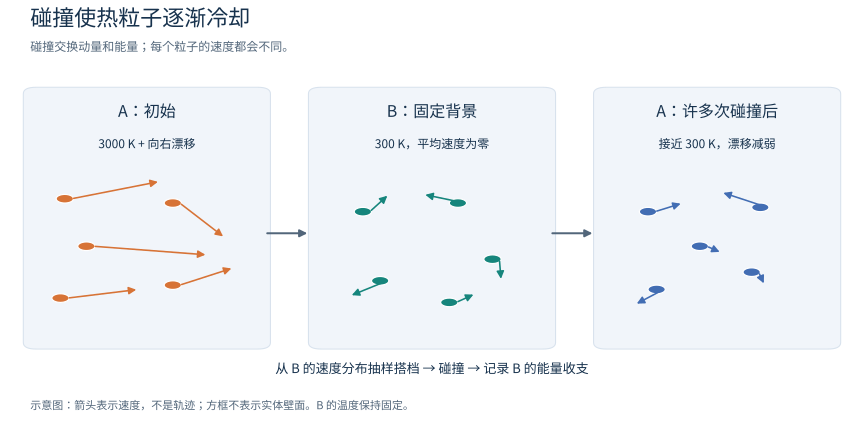
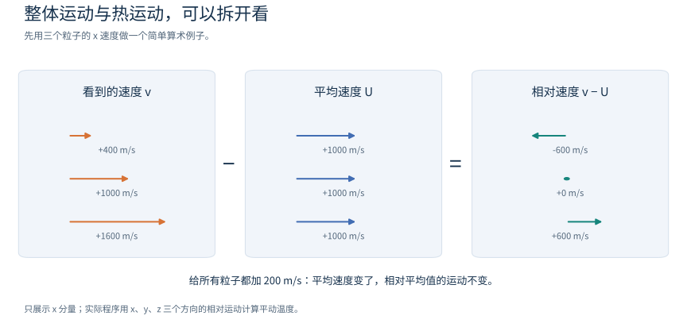
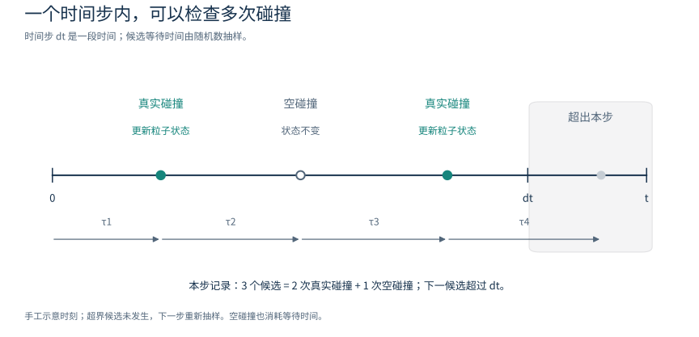

# 零维碰撞盒：看一群热粒子怎样冷却

[中文](README.zh-CN.md) | [English](README.en.md)

这个算例只研究一件事：**一群又热、又整体向右运动的 A 粒子，与较冷的 B 气体反复碰撞后，会怎样变化？**

预期看到两个过程：A 的整体运动逐渐减弱，温度逐渐接近 B 的 300 K。
程序一边模拟，一边与这个简化模型的理论结果比较。你只需要知道速度、动能和平均数，
就能先运行并看懂结果；后面的公式可以第二遍再读。

> **数据用途**：A、B 是虚构的粒子名称，质量和碰撞速率都是为验证程序设置的合成值。
> 这个算例用来检查程序是否按指定规则工作，不能用于真实气体的科研结论。

## 1. 先看物理图像



*图中箭头表示速度，方框用来分组；这是物理过程示意，不是模拟输出。*

可以把 A、B 想成会相互碰撞的小球。这里的小球图像帮助理解动量和能量交换，
程序通过碰撞概率抽样，并不计算两个小球表面何时接触。

| 对象 | 程序怎样描述它 | 默认设置 |
|---|---|---|
| A：我们观察的粒子 | 逐个记录三个方向的速度 | 50,000 个；初始温度 3000 K；整体沿 x 方向以 1000 m/s 运动 |
| B：周围的背景气体 | 给定密度、温度和平均速度；每次碰撞抽取一个 B 的速度 | 密度 `1e20 m^-3`；温度 300 K；平均速度为零 |
| 一次碰撞 | `A + B -> A + B`，只改变速度 | 两者质量都为 `4e-26 kg`；弹性碰撞 |
| 一段模拟时间 | 重复处理这段时间内发生的碰撞 | 200 步，每步 `1e-7 s`，共 20 微秒 |

`1e20` 表示 10 的 20 次方；`1e-7 s` 是 0.1 微秒。
K 是开尔文，300 K 约为 27 °C。这里的密度指“每立方米有多少个 B”，
与程序中保存了多少个 A 是两个不同的参数。

### “零维”是什么意思？

我们把整个气体当作一个均匀区域，只研究它随时间的变化。所有 A 都遇到相同的背景，
不需要区分粒子在盒子的左边还是右边，所以不推进位置，也没有盒壁。
**每个粒子的速度仍有 x、y、z 三个分量。** “零维”说的是空间描述的简化。

这个算例只调用 G02 的碰撞功能，不求解电场，不计算粒子运动轨道，也不需要其他 AlgoPlasma 模块。

### 跟着一个 A 粒子过一遍

给它起个编号 A001。开始时，程序记住它的速度；接着抽样“下一次候选还要等多久”。
如果本步剩余时间不够，就进入下一步。如果发生真实碰撞，就临时抽一个 B 的速度，
算出碰后的两个速度，把 A001 的新速度记下来，同时登记 B 得到或失去的动量与能量。

重复这个过程，就得到每个 A 不同的运动经历。把所有 A 放在一起取平均，
才得到图上较平滑的温度曲线。单个 A 完全可能在某次碰撞中变快，
而整群 A 在较长时间里逐渐冷却。

### 温度与整体运动有什么区别？

想象一群人一起向右走，同时每个人还在前后左右走动：

- 大家的平均速度对应**漂移速度**，也就是这群粒子的整体运动。
- 每个粒子相对平均速度的运动对应**热运动**；这里用它的平均动能来计算温度。

因此，“整体向右很快”和“温度很高”可以分别改变。B 的平均速度为零，
但 300 K 的 B 粒子仍在热运动。文中的温度均指平动温度，即由三个方向的随机运动计算的温度。



拿图中的三个 x 速度算一次：`(400 + 1000 + 1600) / 3 = 1000 m/s`。
减去平均值后，得到 `−600、0、+600 m/s`。给三个粒子都加上 200 m/s，
平均值会变成 1200 m/s，而这三个相对速度保持不变，所以这部分整体加速不会改变温度。
图里只展示一个方向；实际程序同时计算 x、y、z。

### 弹性碰撞为什么还能让 A 冷却？

弹性碰撞保存碰撞双方的**总动量和总动能**。单个 A 可以把部分动能传给 B，
也可以从 B 获得动能；在这个初始条件下，大量碰撞的平均效果是 A 冷却。

B 被当作保持 300 K 的大背景。程序记录 B 收到的动量和能量，但不据此改变 B 的温度。
所以守恒检查要把 **A 的变化 + 背景收到的交换量** 一起计算。固定背景是本算例的假设。

## 2. 运行一次

以下命令在 Linux 或 WSL 的终端执行，当前目录为 AlgoPlasma 仓库根目录。
需要 CMake 3.20 或以上、支持 C++20 的 C++ 编译器；
生成图片还需要 Python 3 与 Matplotlib，默认不需要 MPI/OpenMP。未传 `--model` 时程序生成进程独占的临时合成包并在退出时清理；`--model DIR` 只加载指定目录。

```sh
bash tests/009_collision/G02_MCC_network/examples/collision_box/run.sh
```

脚本自动编译、运行检查、画图。结果目录为：

```text
tests/009_collision/G02_MCC_network/examples/collision_box/results/
```

成功时终端会出现 `collision_box: PASS`；这表示本次实际执行的检查通过。
该目录已被 Git 忽略，CSV 和图片都由本次运行生成。

指定输出目录或改参数时，**第一个参数必须是输出目录**，选项放在它后面：

```sh
bash tests/009_collision/G02_MCC_network/examples/collision_box/run.sh /tmp/box \
    --particles 50000 --steps 200 --dt 1e-7 --seed 42
```

`--seed` 是随机种子，用来确定一串随机数，方便重复同一次实验。
在相同构建与设置下，同一种子可复现结果；换种子后，曲线会有新的统计起伏。

如果 C++ 已打印 `PASS`，随后提示找不到 `matplotlib`，表示检查已通过、绘图尚未完成。
在有 Matplotlib 的 Python 环境里可以单独补画：

```sh
python3 tests/009_collision/G02_MCC_network/examples/collision_box/plot.py /tmp/box
```

这里的 `/tmp/box` 要与实际输出目录一致。

## 3. 先读三张图

### thermalization.png：平均运动和温度怎样变化？

“热化”指粒子的速度统计逐渐接近背景气体的平衡分布。图中 `MCC` 是模拟结果，
`Analytic` 是理论参照。三幅子图从上到下分别是：

1. **Mean vx（平均 x 速度）**：从约 1000 m/s 降到接近零。
2. **Central temperature（扣除整体运动后的温度）**：从约 3000 K 接近 300 K。
3. **Raw mean v²（速率平方的平均值）**：先对每个粒子的速率平方，再取平均，反映包含整体运动在内的平均动能。

横轴 `nu*t`（νt）是“到这个时刻，每个 A 理论上平均碰撞了多少次”，没有单位。
默认设置下，横轴 1 对应 1 微秒，横轴 20 对应 20 微秒。
两条曲线应在统计波动范围内相符；末尾温度在 300 K 附近有起伏是正常的。

### distributions.png：粒子是否都以同一个速度运动？

左图统计 x 方向速度，正值与负值表示相反方向；右图统计**速率**，也就是速度的大小，
它总是非负。图例 `Initial` 表示初始，`Final` 表示末态。

- 左图的末态应集中在零附近，同时仍有正负两个方向的速度。
- 右图的末态应与 300 K 的 Maxwell（麦克斯韦）速率分布接近：有的粒子快、有的慢，
  平衡态仍然包含一整段速率。
- 纵轴是**概率密度**。某一小段速度范围内的粒子比例约等于“曲线高度 × 这段的宽度”，
  不能直接把曲线高度当成粒子比例。

图中的理论线用于对照。程序只在足够接近平衡时才自动检验末态 Maxwell 分布；
缩短模拟时间后，仍在冷却的末态通常还没达到这一分布。

### collision_counts.png：每个粒子撞了多少次？

横轴是单个 A 的真实碰撞次数，纵轴是具有该次数的 A 粒子数量。
默认平均次数为 20，但有的粒子碰撞更少，有的更多。

这种恒定碰撞频率下的随机计数服从 **Poisson（泊松）分布**：
图中柱子是模拟统计，曲线是理论期望。分布的平均值和方差都等于 νt；
方差描述次数分散的程度。一次实际运行的柱子会围绕理论曲线上下起伏。

## 4. 程序怎样决定“碰不碰”？



从左向右读：等待 → 检查候选 → 更新或保持速度 → 再等待。
图中最后一次等待超出了本步剩余时间，所以那次候选不执行；下一步重新抽样。
示意时刻是手工设置的，用于说明调用过程。

本算例给每个 A 一个恒定碰撞频率：

```text
nu = n_B × k0
   = 1e20 × 1e-14
   = 1e6 次/秒
```

`n_B` 是 B 的数密度，`k0` 是二体速率系数，单位为 m³/s。
两者相乘得到单位为 1/s 的碰撞频率；平均等待时间是 `1/nu = 1 微秒`。
具体某一次等待多久由随机数抽样。

默认每步为 0.1 微秒，因此每个 A 每步平均碰撞 0.1 次。
发生至少一次真实碰撞的概率为 `1 - exp(-0.1)`，约 9.52%。
一步内可以发生多次碰撞，程序会继续处理剩余时间。

G02 内部还会产生 **null collision（空碰撞）**：先用一个偏大的频率安排“候选事件”，
再随机判断候选是否成为真实碰撞。未被接受的候选只消耗等待时间，粒子速度不变。
`collision_counts.png` 只统计真实碰撞；空碰撞是抽样计算中的步骤。

两个概率可以这样区分：

| 看的是哪件事 | 默认设置下的数值 |
|---|---|
| 在一个 0.1 微秒时间步里，某个 A 至少发生一次真实碰撞 | 约 9.52% |
| 已经抽到一个候选后，这个候选被接受为真实碰撞 | 本算例默认上界为真实频率的 1.05 倍，因此约 95.24% |

前一行针对一段物理时间，后一行针对一次已经出现的候选，分母不同。

## 5. 怎样判断通过？

看终端状态和本次生成的 `checks.csv`。每行都有以下字段：

| 字段 | 意义 |
|---|---|
| `check` | 检查项目名称 |
| `observed` | 模拟得到的数值 |
| `expected` | 理论值或目标值 |
| `tolerance` | 允许的绝对偏差，单位与该行被检查的量相同 |
| `pass` | `true` 表示通过，`false` 表示失败 |

判据为 `abs(observed - expected) <= tolerance`，也就是“实际偏差不超过允许范围”。
数值含义取决于该行项目，例如速度单位为 m/s，碰撞次数没有单位。

| 检查内容 | 它要排除什么问题？ |
|---|---|
| A 的数量、编号、权重、物种和位置保持不变 | 只有弹性碰撞时，误删了粒子、生成了粒子或改了位置；这些错误会立即终止程序 |
| A 与背景的总动量、总能量收支平衡 | 碰撞后凭空多出或丢失动量、能量 |
| 候选次数 = 真实次数 + 空碰撞次数，空碰撞比例合理 | 事件漏记或接受概率不对 |
| 碰撞次数的平均值、方差符合泊松预期 | 碰撞过多、过少，或随机计数的波动不对 |
| νt 到达 2、10、20 时的平均速度和平均速率平方符合理论 | 冷却和整体运动衰减的速度不对 |
| 足够接近平衡时，末态速度分布符合预期 | 平均量看起来正确，但快慢粒子的分布不对 |

守恒检查使用数值误差容限；统计检查允许有限粒子数造成的波动。
例如平均量的容限主要取六倍**标准误差**，即这次平均值因抽样而起伏的估计尺度。
末态分布用 KS 距离（两条累计比例曲线之间的最大差）检查，容限由 DKW 概率界确定。
首次运行时只需理解：这些规则预先规定了允许多少统计偏差。

默认设置会执行 20 项 CSV 检查，另有运行过程中立即执行的一致性检查。
模拟未达到某个检查时刻、或尚未接近平衡时，相应检查会跳过；
因此短时间运行得到 `PASS`，不等于完成了默认设置的全部检查。
任何实际执行的检查失败，程序返回非零退出状态，运行脚本也会失败。

## 6. 改一个参数，会发生什么？

下表中的选项接在“输出目录”后。每次比较只改一项，更容易理解结果。

| 选项及默认值 | 改动后的预期 |
|---|---|
| `--particles 50000` | 增加 A 的样本数通常使统计曲线更平滑；不会改变给定的 B 密度或单粒子碰撞频率 |
| `--density 1e20` | 密度加倍时，碰撞频率加倍；达到相同 νt 所需的实际时间减半 |
| `--gas-temperature 300` | 改变 A 长时间后趋近的背景温度；合成表覆盖 100–10000 K |
| `--initial-temperature 3000` | 改变 A 初始热运动的强弱 |
| `--drift-x 1000` | 改变 A 初始整体运动；可用 `0` 去掉这部分 |
| `--steps 200`、`--dt 1e-7` | 总时间 = 步数 × 每步时长；比较不同步长时应保持总时间相同 |
| `--seed 20260924` | 换一组随机数，观察统计起伏 |

两个直观的对照实验：

```sh
# 没有 B，A 应保持初始速度
bash tests/009_collision/G02_MCC_network/examples/collision_box/run.sh /tmp/box_no_gas \
    --density 0

# 每一步都不经过任何时间，A 也应保持初始速度
bash tests/009_collision/G02_MCC_network/examples/collision_box/run.sh /tmp/box_no_time \
    --dt 0
```

这两种情况下，碰撞次数应全为零，曲线停留在初始值。
它们不会触发 νt = 2、10、20 或末态平衡检查。
完整自动测试还包含初始平衡态、不同步长和并行结果对照，见
[测试说明](../../README.zh-CN.md)。

### 再试两个小实验

想先动手，可以做下面两个小实验。每个实验先预测曲线，再运行验证。

| 小实验 | 运行选项（放在输出目录之后） | 可以观察什么 |
|---|---|---|
| 从平衡态出发 | `--initial-temperature 300 --drift-x 0` | 温度围绕 300 K 起伏，平均漂移在零附近；单个粒子仍会持续碰撞 |
| 把背景密度翻倍，同时把总时间减半 | `--density 2e20 --steps 100 --dt 1e-7` | 10 微秒就达到 νt=20；按实际时间看冷却更快，按 νt 看仍遵循同一理论规律 |

例如第二个实验的完整命令：

```sh
bash tests/009_collision/G02_MCC_network/examples/collision_box/run.sh /tmp/box_double_density \
    --density 2e20 --steps 100 --dt 1e-7
```

`thermalization.png` 用 νt 作横轴，比较实际快慢时再看 `history.csv` 的 `time_s` 列。
两次模拟仍有各自的抽样起伏，不必要求粒子速度或每个数据点完全一样。

## 7. 理论曲线从哪里来？（可第二遍读）

这组公式只用于本算例：A、B 等质量，背景固定，只有一条弹性通道，
碰撞频率与速度无关，且在**质心系**中各个散射方向同样可能。
质心系就是跟着这对粒子的共同质心一起运动的观察方式。
“各向同性”表示在球面上均匀选择散射方向：球面上面积相同的两小块，被选中的概率相同。

先认识符号：

| 符号 | 含义 |
|---|---|
| `v` | 一个 A 的速度向量；`\|v\|` 是速率 |
| `U = mean(v)` | 全体 A 的平均速度向量，即整体漂移 |
| `Q = mean(\|v\|^2)` | 先把每个 A 的速率平方，再取平均 |
| `m` | 单个 A 或 B 的质量，单位 kg |
| `T_B` | B 的固定温度，单位 K |
| `k_B` | 玻尔兹曼常数，`1.380649e-23 J/K`，用于联系温度与粒子能量 |
| `nu`、`t` | 真实碰撞频率（1/s）与经过的时间（s） |
| `U0`、`Q0` | 程序实际抽样得到的初始 U、Q |
| `exp(x)` | 指数函数 e 的 x 次方；`exp(-nu*t/2)` 从 1 逐渐降向 0 |

在这些假设下，对随机的 B 速度和散射方向取平均，一次碰撞使 A 的平均速度变成原来的一半，
并使其平均速率平方与背景对应值的差缩小一半。**这是许多随机碰撞的平均规律，
单个粒子的每次碰撞并不固定减半。** 再把随机的碰撞次数考虑进去，就得到：

```text
U(t) = U0 × exp(-nu*t/2)
Q(t) = 3 k_B T_B/m + (Q0 - 3 k_B T_B/m) × exp(-nu*t/2)
T(t) = m × (Q(t) - |U(t)|^2) / (3 k_B)
```

前两式描述平均量怎样逐渐接近平衡。第三式把扣除整体运动后的平均动能换成温度；
其中 `|U|^2` 是“平均速度再平方”，与 Q 的“先平方再平均”不同。
这样就不会把初始漂移算进温度。默认 νt = 20 时，衰减因子为 `exp(-10)`，约 0.0000454，
所以整体漂移已很小，温度接近 300 K。

程序使用实际初始样本的 U0、Q0，避免把初始化时的随机偏差误算成碰撞误差。
换用其他模型时，上述公式通常不再适用；程序会检查所需假设，不满足就报错。

## 8. 文件与进阶用法

| 文件 | 保存什么 |
|---|---|
| `history.csv` | 每一步的平均速度、温度、理论参照、事件计数和守恒残差 |
| `distribution.csv` | 初始与末态的速度/速率直方图，以及适用的 Maxwell 理论曲线 |
| `collision_counts.csv` | 各种真实碰撞次数对应的粒子数量，以及泊松理论数量 |
| `checks.csv` | 本次检查的数值、容限与通过状态 |
| `parameters.csv` | 参数及性能记录，便于重现；MCC 耗时不包含绘图和诊断 |
| 三张 `.png` | 上述数据的图形；由独立的 `plot.py` 生成 |

完整测试从仓库根目录运行：

```sh
bash tests/009_collision/G02_MCC_network/run.sh
```

测试项和 MPI/OpenMP 运行方式见
[测试说明](../../README.zh-CN.md)。

如果只运行 C++ 程序、不画图，可以直接调用已构建的可执行文件。
默认运行脚本的构建位置是 `/tmp/g02_collision_box_build`；
设置环境变量 `COLLISION_BOX_BUILD_DIR` 可以修改它。

```sh
/tmp/g02_collision_box_build/collision_box/collision_box \
    --output /tmp/box
```

OpenMP 可让多个 CPU 线程一起计算。构建时启用，再选择后端：

```sh
G02_MCC_ENABLE_OPENMP=ON bash tests/009_collision/G02_MCC_network/examples/collision_box/run.sh \
    /tmp/box_omp --backend openmp --threads 4 --compare-backends
```

`--compare-backends` 会额外运行串行版本，检查两者逐粒子一致。
MPI 示例另见 [`mpi_collision_box`](../mpi_collision_box/main.cpp)。

也可以链接已安装的 G02。从仓库根目录运行，将 `/path/to/g02/install` 换成自己的安装目录；
未传 `--model` 时自动生成临时验证数据：

```sh
cmake -S tests/009_collision/G02_MCC_network/examples/collision_box \
    -B /tmp/collision_box_external -DCMAKE_PREFIX_PATH=/path/to/g02/install
cmake --build /tmp/collision_box_external
/tmp/collision_box_external/collision_box \
    --output /tmp/box
```

想补充热运动背景，可读 OpenStax 的
[温度与粒子运动](https://openstax.org/books/university-physics-volume-2/pages/2-2-pressure-temperature-and-rms-speed)
和[速率分布](https://openstax.org/books/university-physics-volume-2/pages/2-4-distribution-of-molecular-speeds)。
G02 的接口与模型表格见[模块说明](../../../../../G_Collision/G02_MCC_network/README.zh-CN.md)。

## 9. 从看懂算例到读懂程序

可以用自己的话串起这三个关系：背景密度决定碰撞有多频繁，
碰撞让粒子交换动量和能量，很多粒子的统计构成温度与分布。
然后沿着程序的调用链读：

```text
main.cpp 建立 A 和 B
    → MccStepper::step 处理一个时间步
    → MccEngine 给每个 A 抽样碰撞
    → 运动学函数计算产物速度
    → 汇总统计、提交粒子更新
    → 写 CSV；plot.py 读 CSV 画图
```

完整的[架构说明页](../../../../../docs/source/rst_files/G_Collision/G02_MCC_network.rst)
和 [C++ 批量接口](../../../../../docs/source/rst_files/G_Collision/G02_MCC_network/fun_G02_mcc_batch.rst)
另行保留参数、类型、失败处理与调用示例。
本教程继续作为物理入门入口，前面的原理、公式、判据和运行方式都可独立阅读。

## MCC 文献与解析依据

本算例的时钟和两体碰撞使用标准随机抽样与质心运动学；文献、对应代码以及第 7 节曲线的完整推导见[方法与验证文献](../../../../../docs/source/rst_files/G_Collision/G02_MCC_network/references.rst)。这里的等质量、恒频率模型由本库构造，曲线从单次碰撞的条件期望及 Poisson 计数推导，不是某篇论文的气体数据或算例复现。恒定截面不能代替恒定频率假设。
